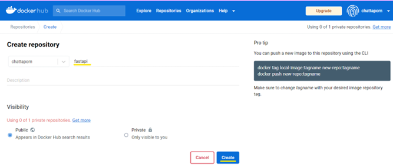
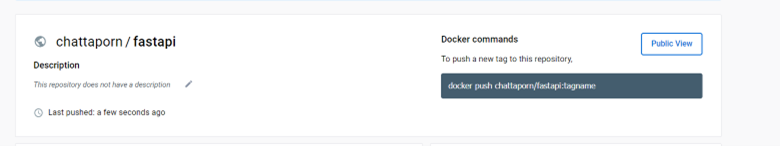
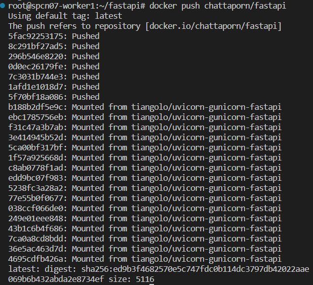
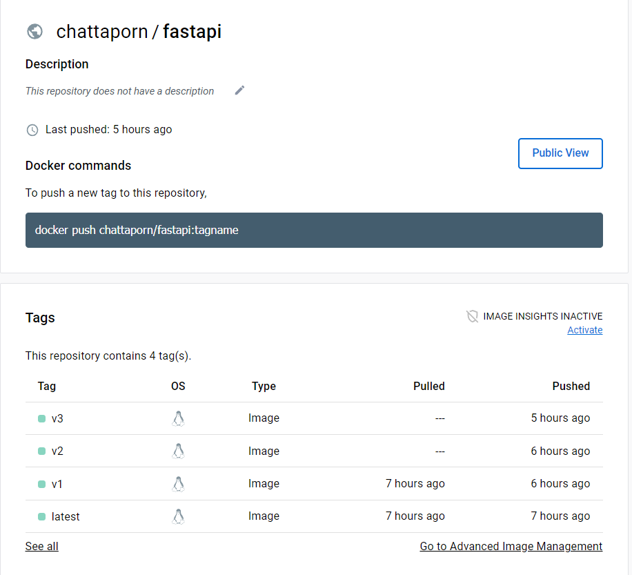
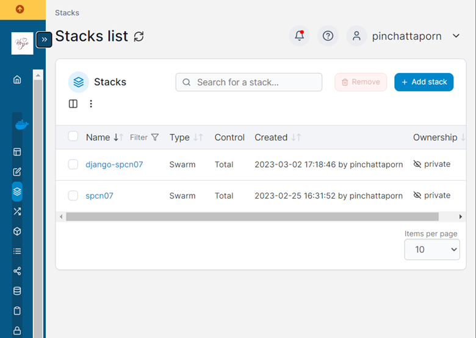
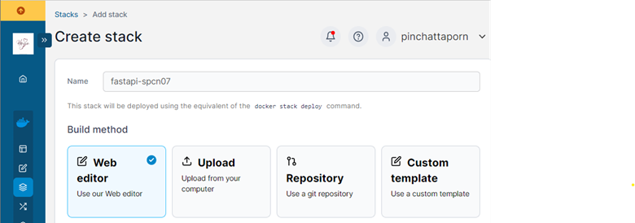
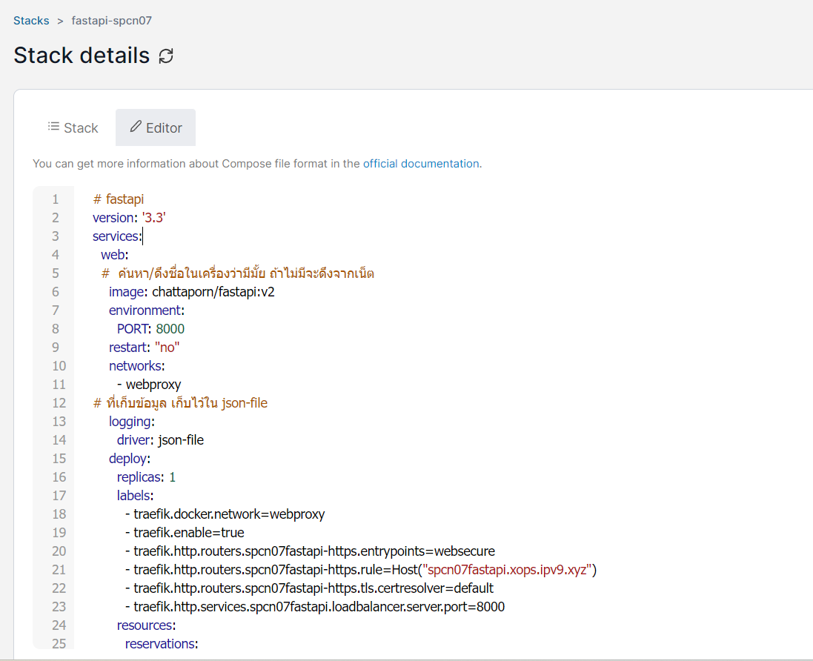
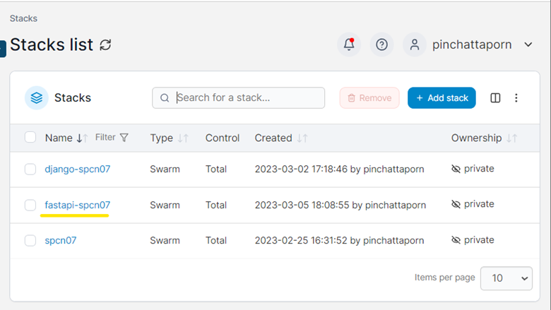
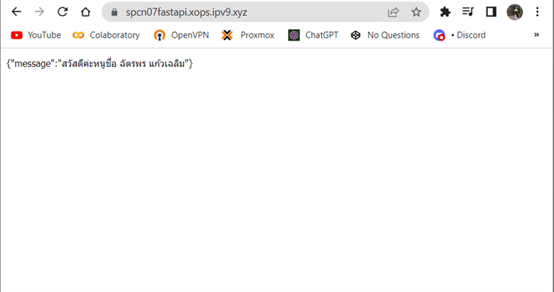

# swarm01 fastapi

Ref. awaresome-compose

- https://github.com/docker/awesome-compose/tree/master/fastapi

Wakatime project

- https://wakatime.com/@spcn07/projects/wzcblnafge?start=2023-02-27&end=2023-03-05

Url fastapi

- https://spcn07fastapi.xops.ipv9.xyz/

## ขั้นตอนการสร้าง

- [1.Create fastapi](#1create-fastapi)
- [2.Images On Dockerfile](#2build-images-on-dockerfile)
- [3.แก้ไขข้อมูลไฟล์](#3แก้ไขข้อมูลไฟล์)
- [4.deploy stack](#4-deploy-stack)
- [5.เช็คการเข้าใช้งาน Url.](#5เช็คการเข้าใช้งาน-url)

# **1.Create fastapi**

- ทำการ Clone github จาก
  Ref.

  - https://github.com/docker/awesome-compose/tree/master/fastapi

  
  
  


# **2.Images On Dockerfile**
- สร้างไฟล์ main.py
<details>
<summary>Show code</summary>

```ruby
from fastapi import Fastapi

app = Fastapi

@app.get("/")
def hello_world():
    return {"message": "สวัสดีค่ะหนูชื่อ ฉัตรพร แก้วเฉลิม"} #แสดงข้อความที่เราต้องการให้แสดง
```
</details>

- สร้างไฟล์ requirements.txt in /app
<details>
<summary>Show code</summary>

```ruby
ffastapi
uvicorn
```
</details>

- สร้าง Dockerfile in /app
<details>
<summary>Show code</summary>

```ruby
# syntax = docker/dockerfile:1.4

FROM tiangolo/uvicorn-gunicorn-fastapi:python3.9-slim AS builder

WORKDIR /app

COPY requirements.txt ./
RUN --mount=type=cache,target=/root/.cache/pip \
    pip install -r requirements.txt

COPY ./app ./app

FROM builder as dev-envs

RUN <<EOF
apt-get update
apt-get install -y --no-install-recommends git
EOF

RUN <<EOF
useradd -s /bin/bash -m vscode
groupadd docker
usermod -aG docker vscode
EOF
# install Docker tools (cli, buildx, compose)
COPY --from=gloursdocker/docker / /
```
</details>


- โดยการเข้าที่ Docker hub -> Create repository -> ตั้ง Name = fastapi

<center></center>
<center></center>

- copy path: chattaporn/fastapi

        โดยใช้คำสั่ง
         docker build . -t chattaporn/fastapi:v1

- push ขึ้น Dockerhub
  - ใช้คำสั่ง docker login เพื่อเข้าสู่ระบบก่อน
  - ใช้คำสั่ง docker push chattaporn/fastapi

<center></center>
    
    * ผลลัพธ์จากรัน
      
<center></center>

# **3.แก้ไขข้อมูลไฟล์**

- แก้ไขข้อมูล docker-compose.yaml
 <details>
<summary>Show code</summary>

```ruby
version: '3.3' #version compose ต้องมากกว่า 3
services:
  web:
    image: chattaporn/fastapi:v2  #image service on dockerhub
    container_name: fastapi-application
    environment:
      - 8000
    restart: "no"
    networks:
      - webproxy  #network traefik
    logging: # ที่เก็บข้อมูล เก็บไว้ใน json-file
      driver: json-file
    deploy: # set ข้อมูล deploy for swarm
      replicas: 1
      labels: #set ข้อมูล label เพื่อเชื่อมต่อกับ traefik
        - traefik.docker.network=webproxy
        - traefik.enable=true
        - traefik.http.routers.spcn07fastapi-https.entrypoints=websecure
        - traefik.http.routers.spcn07fastapi-https.rule=Host("spcn07fastapi.xops.ipv9.xyz")
        - traefik.http.routers.spcn07fastapi-https.tls.certresolver=default
        - traefik.http.service.spcn07fastapi.loadbalancer.server.port=8000
      resources:
        reservations:
          cpus: '0.1'
          memory: 15M
        limit:
          cpus: '0.4'
          memory: 150M
networks:
webproxy:
external: true
 ```

 </details>

# **4.deploy stack**
     
* https://portainer.ipv9.me/

        โดยทำการ กด Aff Stack -> ตั้งชื่อ fastapi-spcn07 -> วางโค้ด docker-  compose.yaml ที่ wab editor -> Deploy the stack

    <center></center>

    <center></center>

    <center></center>

- ผลลัพธ์จากการ deploy stack

    <center></center>

# **5.เช็คการเข้าใช้งาน Url.**

- เช็คว่า Url เข้าใช้งานได้จริงมั้ย แสดงผลจริงมั้ย

  - https://spcn07fastapi.xops.ipv9.xyz/

  - ผลลัพธ์

    <center></center>

Ref.ทั้งหมด

- https://github.com/pitimon/dockerswarm-inhoure/tree/main/ep03-traefik

- https://github.com/pitimon/dockerswarm-inhoure
