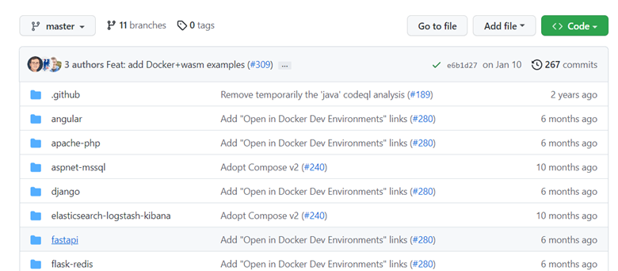

# swarm01 fastapi
Ref. awaresome-compose
    
- https://github.com/docker/awesome-compose/tree/master/fastapi

Wakatime project
- https://wakatime.com/@spcn07/projects/wzcblnafge?start=2023-02-27&end=2023-03-05

Url fastapi
- https://spcn07fastapi.xops.ipv9.xyz/

## ขั้นตอนการสร้าง
 - [1.Create fastapi](#1create-fastapi)
 - [2.Images On Dockerfile](#2build-images-on-dockerfile)
 - [3.แก้ไขข้อมูลไฟล์](#3แก้ไขข้อมูลไฟล์)
 - [4.deploy stack](#4-deploy-stack)
 - [5.เช็คการเข้าใช้งาน Url.](#5เช็คการเข้าใช้งาน-url)

 # **1.Create fastapi**

- ทำการ Clone github จาก
  Ref.
  
    - https://github.com/docker/awesome-compose/tree/master/fastapi

  
  

- ทำการแก้ไขข้อมูลไฟล์ main.py

  - โดยเข้าไปที่ app -> main.py -> แก้ไขข้อความตรง message: สวัสดีค่ะหนูชื่อ ฉัตรพร แก้วเฉลิม

# **2.Images On Dockerfile**
  - โดยการเข้าที่ Docker hub -> Create repository -> ตั้ง Name = fastapi

- copy path:  chattaporn/fastapi

        โดยใช้คำสั่ง  
         docker build . -t chattaporn/fastapi:v1

- push ขึ้น Dockerhub
    * ใช้คำสั่ง docker login เพื่อเข้าสู่ระบบก่อน
    * ใช้คำสั่ง docker push chattaporn/fastapi

    
    * ผลลัพธ์จากรัน
      

# **3.แก้ไขข้อมูลไฟล์**

- แก้ไขข้อมูล docker-compose.yaml

    

# **4.deploy stack***
     
* https://portainer.ipv9.me/

 
        โดยทำการ กด Aff Stack -> ตั้งชื่อ fastapi-spcn07 -> วางโค้ด docker-  compose.yaml ที่ wab editor -> Deploy the stack

    

    

    

* ผลลัพธ์จากการ deploy stack

   
    

# **5.เช็คการเข้าใช้งาน Url.***

- เช็คว่า Url เข้าใช้งานได้จริงมั้ย แสดงผลจริงมั้ย

    * https://spcn07fastapi.xops.ipv9.xyz/

    * ผลลัพธ์

    

Ref.ทั้งหมด
 
 * https://github.com/pitimon/dockerswarm-inhoure/tree/main/ep03-traefik

 * https://github.com/pitimon/dockerswarm-inhoure

 